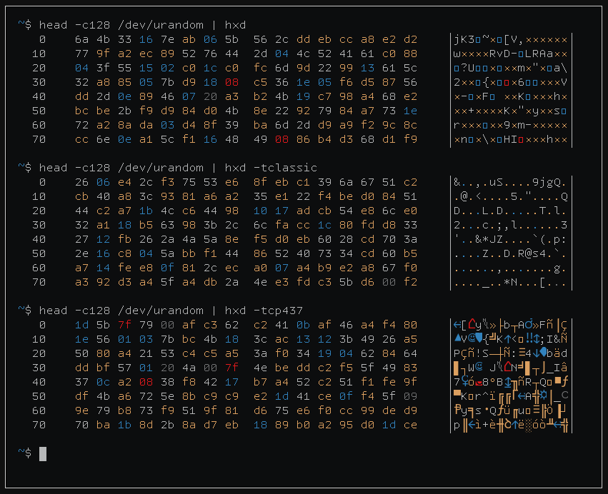

## huxdemp (aka `huxd`)

`huxdemp` is an advanced version of the venerable `hexdump` that uses
colors, bolding, and other terminal formatting to distinguish between `nul`
bytes, ASCII whitespace, UTF8-control characters, ASCII control characters,
and normal printable bytes.

**NOTE**: This should be considered `beta` software. Expect a multitude of
bugs and snakes, and count the directories in your $HOME after you use
`huxdemp`.

### Seeing is believing





### Features/Anti-features

- No octal dumping (this *might* be added later).
- "Highlights" bytes that "belong" to the same UTF8-encoded character.
- Readable source, written in literate programming using a dialect of `unu`
  from [RetroForth](https://forth.works/).
- Ability to print characters in IBM's code page 437 (see screenshots).
- Ability to print control characters using fancy Unicode glyphs (e.g. ␀
  for NUL, ␌ for FF (form feed), etc).
- Not written in Rust. (The horrors!)

### Install

#### Requirements

- A POSIX system. (Windows is not supported at present.)
- [`scdoc`](https://git.sr.ht/~sircmpwn/scdoc) (*for building from source*)
- A C99 compiler and GNU Make (*for building from source*)

#### Arch Linux

```
yay huxd
```

#### Download

Download a binary tarball from the releases, unpack, and move the
executable into your $PATH and the manpage (`huxd.1`) to someplace like
`/usr/local/share/man/man1/huxd.1`.

---

#### Building from source

Clone (or download a tarball from the releases), make, and install:

```
$ cd huxdemp
$ make
    CCLD    unu
    UNU     main.c
    CCLD    huxd
    SCDOC  
$ sudo make install
[sudo] password for kiedtl:
$
```

### TODO

- hexdump's **-n* and *-s* option.
- An option to change the order/format of the columns.
- A $HXD_COLORS variable to change the display style of the ASCII/byte
  column.
- A flag to display the ASCII column in bold.
- A flag to "mark" the nth byte of the input.
- Make unu use `#line` preprocessor directive in order to make compilation
  errors more readable.
- Automatically pipe output through $PAGER when necessary.
- Unicode rune pane.
- Use `pledge(2)`/`unveil(2)` on OpenBSD.
- Support Windows 10/11.

### License

This project is licensed under the GPLv3 license, with the exception of
`utf8.c`, which comes from [`termbox`](https://github.com/nsf/termbox) and
is licensed under the MIT license.
