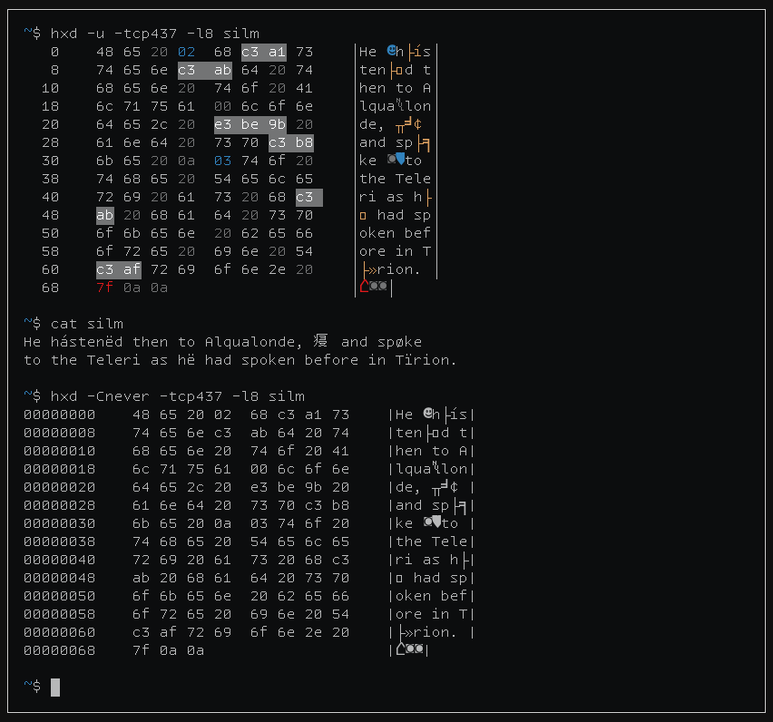
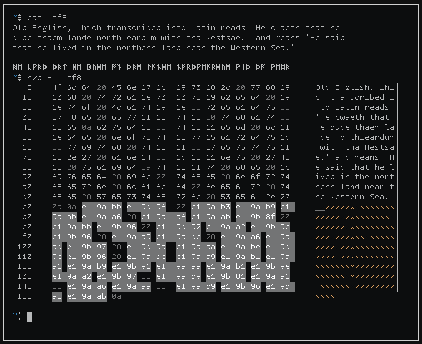

## huxdemp (aka `huxd`)

`huxdemp` is an advanced version of the venerable `hexdump` that uses
colors, bolding, and other terminal formatting to distinguish between `nul`
bytes, ASCII whitespace, UTF8-control characters, ASCII control characters,
and normal printable bytes.

**NOTE**: This should be considered `beta` software. Expect a multitude of
bugs and snakes, and count the directories in your `$HOME` after you use
this tool.

### Features/Anti-features

- "Highlights" bytes that "belong" to the same UTF8-encoded character.
- `$HUXD_COLORS` can be set to customize color choices.
- Ability to print characters in IBM's code page 437 (see screenshots).
- Ability to print control characters using fancy Unicode glyphs (e.g. ␀
  for NUL, ␌ for FF (form feed), etc).
- Automatic display through `less(1)` when needed.
- Readable source, written in literate programming using a dialect of `unu`
  from [RetroForth](https://forth.works/).

### Anti-features

- No OpenBSD support. (This will be worked on soon. Patches welcome!)
- No octal dumping. (This *might* be added later.)
- No Windows support.
- Not written in Rust. (The horrors!)

### Seeing is believing

*Reading a snippet from the Silmarillion*:


*Reading some UTF8 text, demonstrating the -u flag*:


*Reading `/dev/input/mouse`*:


*Reading part of a PNG image*:


*Reading `/dev/urandom`*:


### Usage

```
$ ./huxd -h
Usage: ./huxd [-hV]
       ./huxd [-cu] [-n length] [-s offset] [-t table]
              [-C color?] [-P pager?] [FILE]...

Flags:
    -c  Use Unicode glyphs to display the lower control
        chars (0 to 31). E.g. ␀ for NUL, ␖ for SYN (0x16), &c
    -u  Highlight sets of bytes that 'belong' to the same UTF-8
        encoded Unicode character.
    -h  Print this help message and exit.
    -V  Print huxd's version and exit.

Options:
    -l  Number of bytes to be displayed on a line. (default: 16)
    -n  Maximum number of bytes to be read (can be used with -s flag).
    -s  Number of bytes to skip from the start of the input. (default: 0)
    -t  What 'table' or style to use.
        Possible values: `default', `cp437', or `classic'.
    -C  When to use fancy terminal formatting.
        Possible values: `auto', `always', `never'.
    -P  When to run the output through a less(1).
        Possible values: `auto', `always', `never'.

Arguments are processed in the same way that cat(1) does: any
arguments are treated as files and read, a lone "-" causes huxd
to read from standard input, &c.

See the manpage huxd(1) for more documentation.
$
```

### Install

#### Requirements

- A POSIX system. (Windows is not supported at present.)
- [`scdoc`](https://git.sr.ht/~sircmpwn/scdoc) (*for building from source*)
- A C99 compiler and GNU Make (*for building from source*)

#### Arch Linux

```
yay huxd
```

#### Download

Download a binary tarball from the releases, unpack, and move the
executable into your $PATH and the manpage (`huxd.1`) to someplace like
`/usr/local/share/man/man1/huxd.1`.

---

#### Building from source

Clone (or download a tarball from the releases), make, and install:

```
$ cd huxdemp
$ make
    CCLD    unu
    UNU     main.c
    CCLD    huxd
    SCDOC   huxd.1
$ sudo make install
[sudo] password for kiedtl:
$
```

### TODO

- An option to change the order/format of the columns.
  - Allow splitting the ASCII column into half. E.g., first-byte, first-ascii,
    second-byte, second-ascii
- Unicode rune pane.
- A flag to "mark" the nth byte of the input, with both an absolute and relative
  position. (Is this really needed?)
  - relative: "huxd -m 0x34,12,0o45 < foo"
  - absolute: "huxd -M 0x34,12,0o45 < foo"
- Support for OpenBSD.
- Use skeeto's branchless utf8 decoder design to make this tool Blazing Fast™.
- Use `pledge(2)`/`unveil(2)` on OpenBSD.
- Support Windows 10/11.

### License

This project is licensed under the GPLv3 license, with the exception of
`utf8.c`, which comes from [`termbox`](https://github.com/nsf/termbox) and
is licensed under the MIT license.
